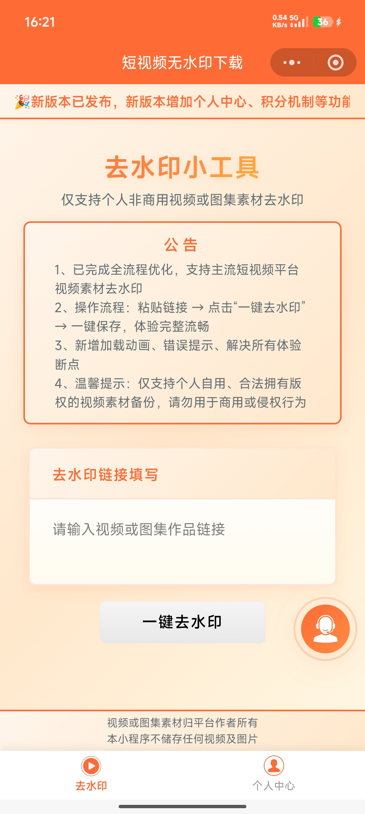
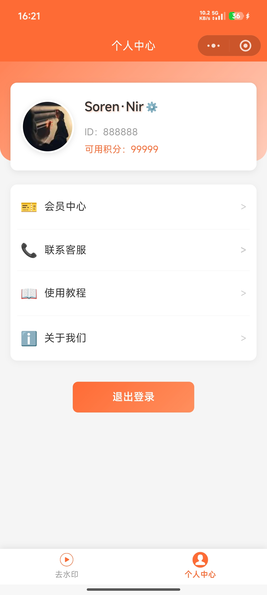
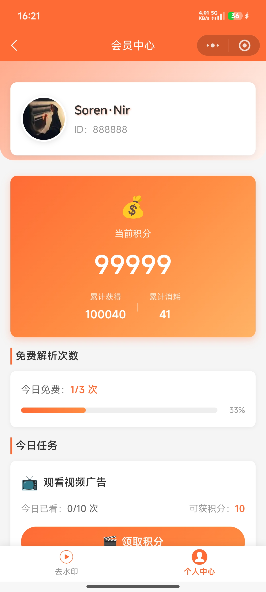
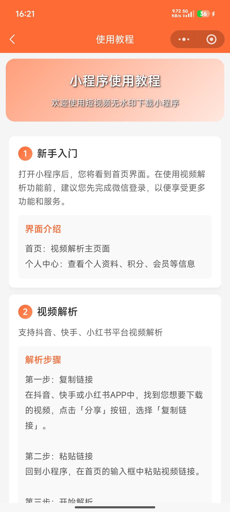
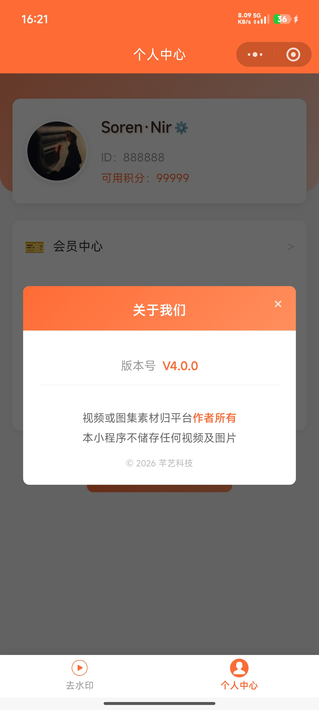
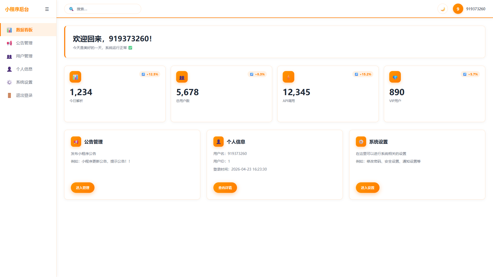
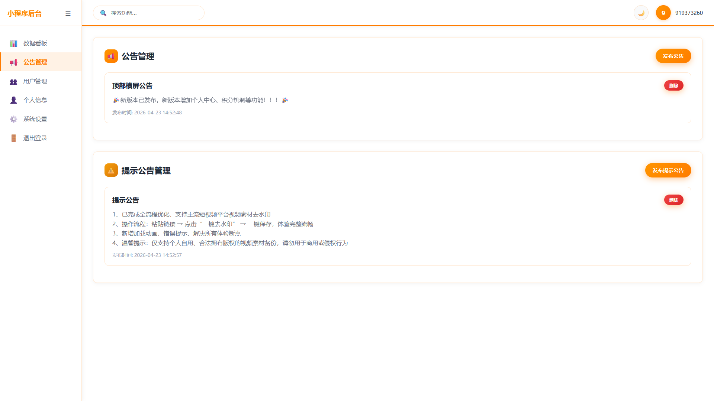
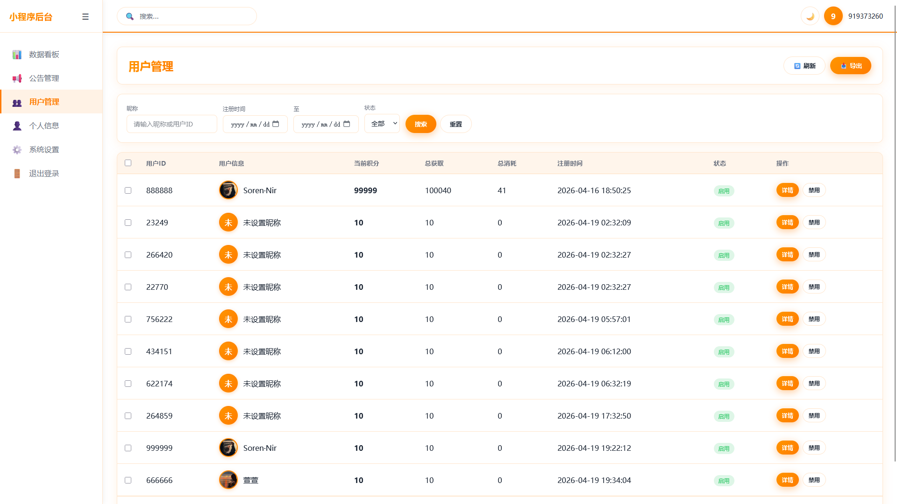
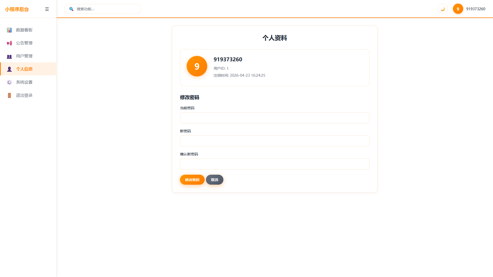
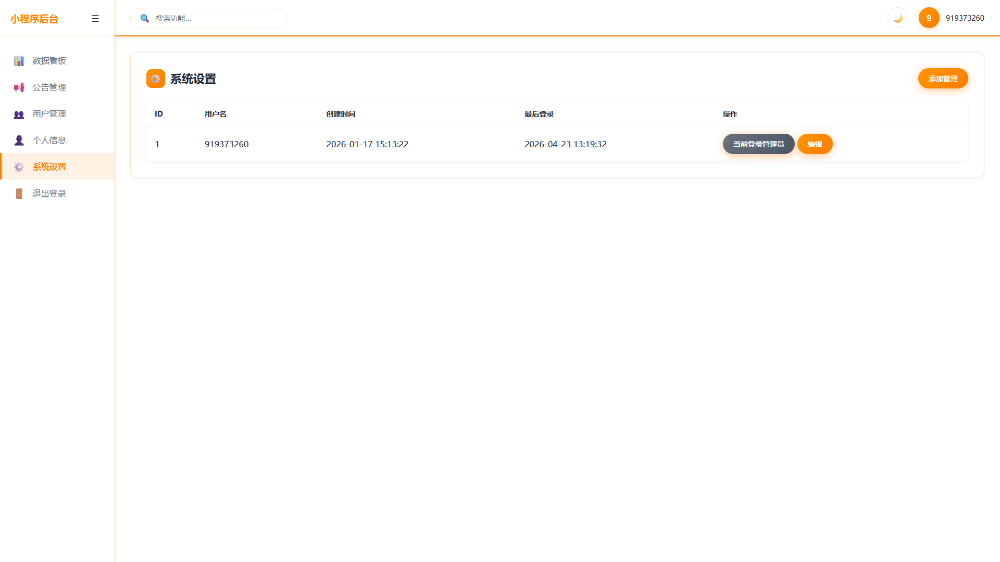

# 短视频无水印下载小程序

一款功能完善的微信小程序，专注提供抖音、快手、小红书等主流平台短视频的无水印下载服务。

---

## 联系作者

- **GitHub**: https://github.com/qianyi888666/wsy
- **开发者**: Soren·Nir 厉温
- **QQ**: 919373260（添加时请备注来意！！！）

---

## 核心功能

### 1. 短视频一键去水印
- 支持**抖音**、**快手**、**小红书**三大主流平台
- 只需粘贴视频链接，即可快速获取无水印视频
- 智能识别链接格式，自动匹配解析方案

### 2. 微信授权登录
- 一键微信授权，快速注册/登录
- 自动保存用户信息，下次打开自动登录

### 3. 个人中心
- 头像、昵称自主修改
- 实时显示用户ID
- 常用功能快捷入口

### 4. 免费解析次数
- 新用户**每日免费3次**解析机会
- 实时显示剩余次数

### 5. 积分账户管理
- 查看当前积分余额
- 累计获得/消耗统计
- 积分明细记录

### 6. 积分记录查询
- 详细记录每次积分收支
- 清晰查看积分来源与用途

### 7. 实时公告通知
- 首页轮播公告
- 重要信息即时推送
- 每5秒自动更新内容

### 8. 使用教程
- 新手入门指南
- 常见问题解答
- 平台使用说明

### 9. 联系客服
- 一键跳转客服会话
- 问题及时反馈

### 10. 用户管理
- 查看/搜索所有用户
- 积分充值与调整
- 账户状态启用/禁用

### 11. 公告管理
- 发布/编辑系统公告
- 重要通知即时推送

### 12. 管理员账号管理
- 多管理员账号支持
- 权限分级管理
- 操作日志记录

---

## 界面展示

### 小程序端

### 管理后台

---

## 版本

当前版本：V4.0.0

最后更新：2026-04-18
