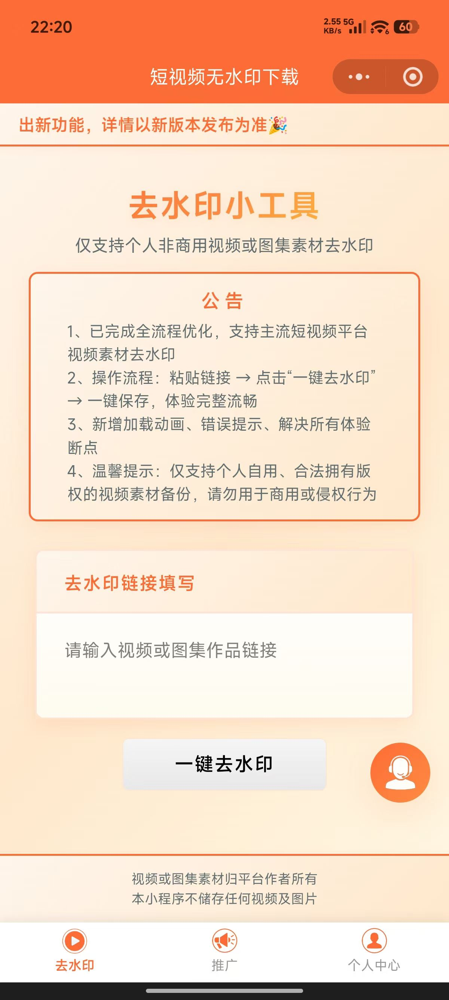
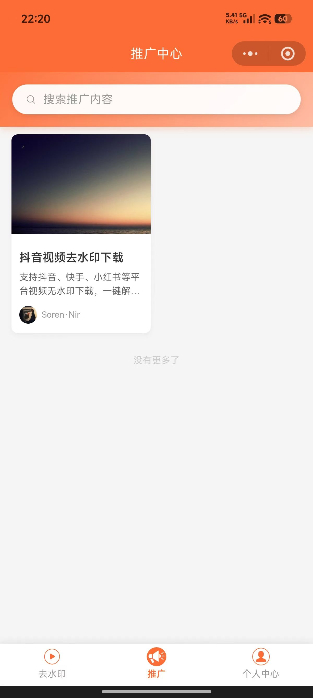
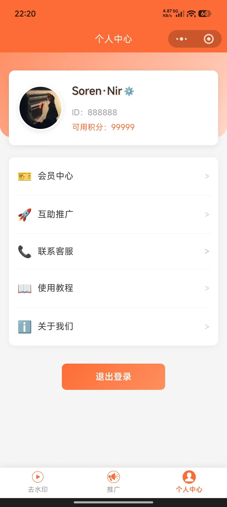
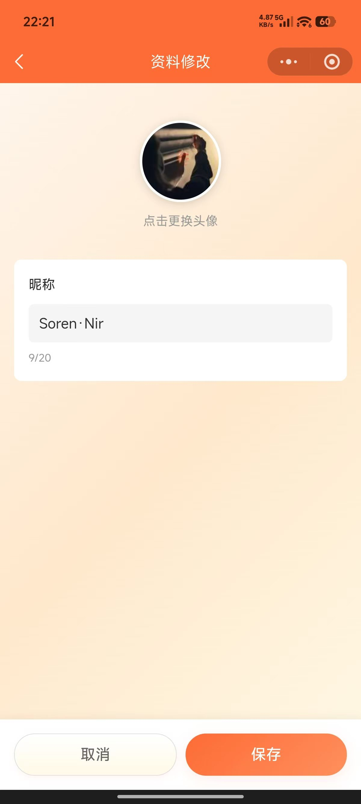
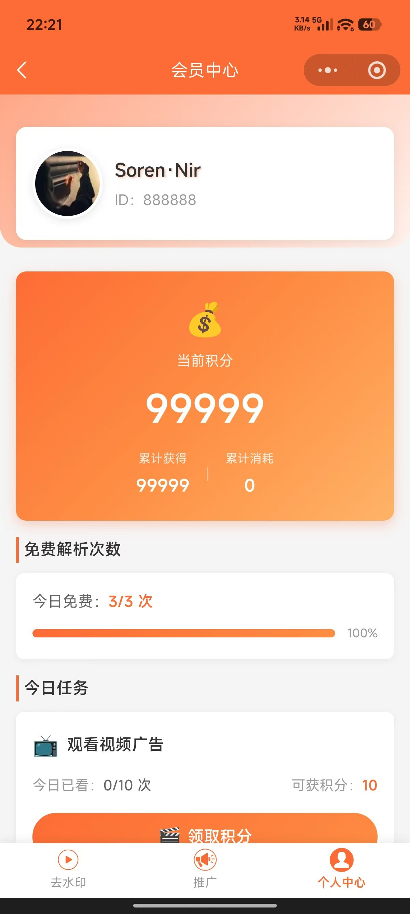
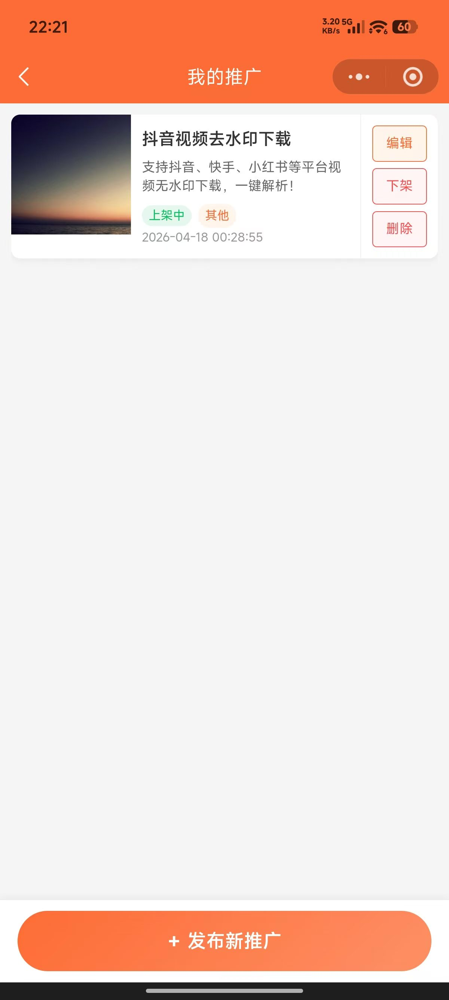
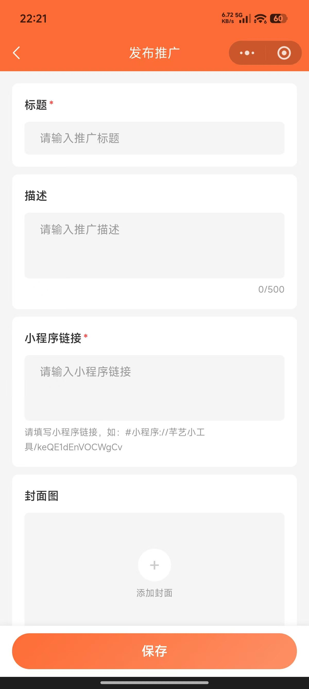
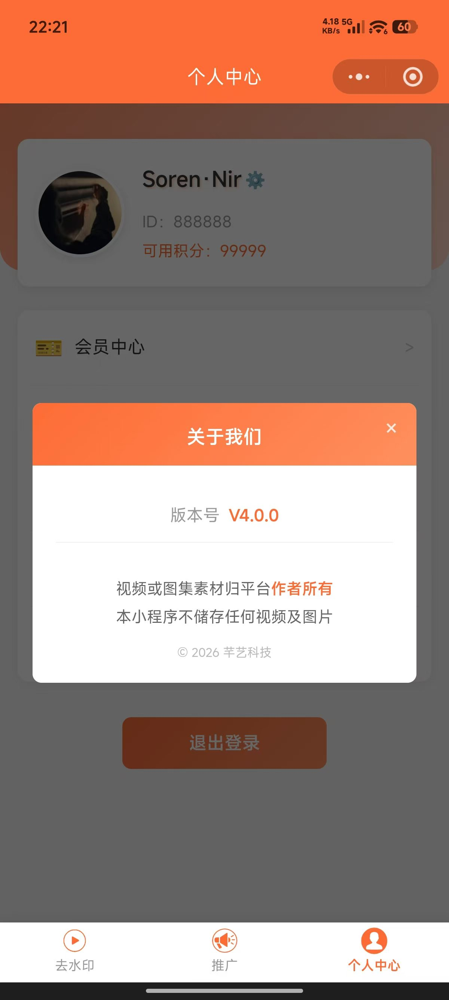

# 短视频无水印下载小程序

一款功能完善的微信小程序，专注提供抖音、快手、小红书等主流平台短视频的无水印下载服务。

---

## 联系作者

- **GitHub**: https://github.com/qianyi888666/wsy
- **开发者**: Soren·Nir 厉温
- **QQ**: 919373260（添加时请备注来意！！！）

---

## 核心功能

### 📱 视频解析

支持多平台短视频一键解析，获取无水印视频地址。

- **多平台覆盖**
  - 抖音短视频解析
  - 快手短视频解析
  - 小红书视频解析
  
- **智能识别**
  - 自动识别视频来源平台
  - 自动提取有效链接，过滤无效内容
  
- **便捷操作**
  - 一键复制无水印链接
  - 一键下载视频到相册
  - 在线视频预览播放

---

### 👤 用户系统

完善的用户账号体系，提供流畅的登录体验。

- **微信登录**
  - 微信一键授权登录
  - 无需注册，自动创建账号
  - 登录状态持久化
  
- **个人资料**
  - 自定义昵称修改
  - 头像上传更换
  - 实时同步更新

---

### 💎 积分体系

灵活的积分机制，激励用户活跃度。

- **免费次数**
  - 每日赠送免费解析次数
  - 次数消耗实时提醒
  
- **积分获取**
  - 看广告领取积分
  - 每日签到积分奖励
  
- **积分记录**
  - 完整的积分获取/消费明细
  - 清晰的账目流水

---

### 🚀 推广中心

用户可自主发布和浏览推广内容，实现流量互推。

- **内容发布**
  - 推广图片上传
  - 推广链接添加
  
- **内容浏览**
  - 瀑布流展示推广内容
  - 关键词搜索
  
- **我的推广**
  - 查看已发布的推广列表
  - 上下架管理
  - 内容编辑修改

---

### ⚙️ 管理后台

配套的Web端管理系统，方便运营维护。

- **账号管理**
  - 管理员账号增删改查
  - 密码修改
  
- **公告管理**
  - 发布系统公告
  - 编辑/删除公告
  
- **个人中心**
  - 个人资料修改

---

## 📸 界面展示

小程序界面截图预览

 
 
 
 

---

## 版本

当前版本：V4.0.0

最后更新：2026-04-18
